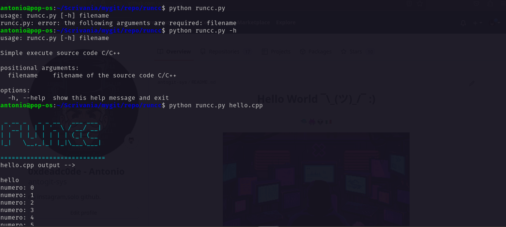

<h1 align="center">RUNCC<h1>

<p>
    
</p>

## 1. Introdution

Runcc.py is a tool created to execute C and C++ source files quickly and easily directly from the command line. With a user-friendly syntax and an automated compilation and execution process, runcc.py allows you to easily view the output of your code without having to deal with complex manual compilation steps. It's a versatile and convenient tool to streamline your development workflow and achieve fast and accurate results.

## 2. Install

##### 2.1 Install Windows

```cmd
cp runcc.py %WINDIR%\system32
```

##### 2.2 install Linux

    work in progress..


## 3. Use

```bash
runcc --help
```
